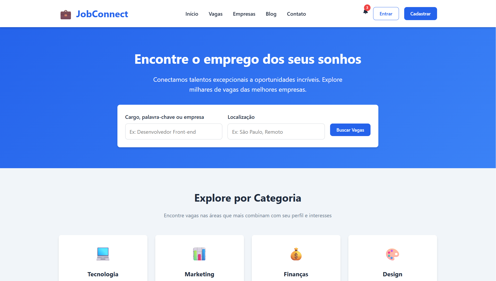

# JobConnect - Plataforma de Conexão Profissional

## 🖥️ Preview do Sistema

<div align="center">
  
  <br>
  <sup>Interface principal da plataforma JobConnect</sup>
</div>

## 📋 Sobre o Projeto

O **JobConnect** é uma plataforma web moderna e responsiva desenvolvida para conectar talentos a oportunidades de emprego. A plataforma facilita o processo de busca por vagas, candidatura e gestão de carreira para profissionais, enquanto oferece às empresas uma forma eficiente de encontrar os candidatos ideais.

## 🎯 Objetivo

A plataforma tem como objetivo principal:
- **Para candidatos**: Oferecer uma experiência intuitiva para encontrar vagas, gerenciar candidaturas e desenvolver a carreira
- **Para empresas**: Proporcionar uma ferramenta eficiente para recrutamento e seleção de talentos
- **Digitalizar processos**: Modernizar o mercado de trabalho através de tecnologia acessível e user-friendly

## 💼 Funcionalidades Principais

### 1. **Sistema de Busca Avançada**
- Busca por cargo, palavra-chave ou empresa
- Filtragem por localização e tipo de trabalho
- Interface intuitiva e resultados em tempo real

### 2. **Catálogo de Vagas Organizado**
- Categorias profissionais específicas (Tecnologia, Marketing, Finanças, etc.)
- Informações detalhadas sobre cada vaga
- Destaque para oportunidades relevantes

### 3. **Dashboard do Candidato**
- **Visão Geral**: Estatísticas de candidaturas e andamento
- **Minhas Candidaturas**: Histórico e status de todas as aplicações
- **Meu Currículo**: Upload e gestão de currículos
- **Notificações**: Alertas sobre vagas e atualizações
- **Meu Perfil**: Gestão completa de informações pessoais

### 4. **Sistema de Autenticação**
- Cadastro para candidatos e empresas
- Login seguro com remember me
- Recuperação de senha

### 5. **Design Responsivo**
- Layout adaptável para todos os dispositivos
- Experiência mobile-first
- Interface acessível e moderna

## 🛠️ Como Funciona

### Para Candidatos:
1. **Cadastro**: Criação de conta pessoal
2. **Busca**: Exploração de vagas por categoria ou palavra-chave
3. **Perfil**: Completação do perfil profissional
4. **Currículo**: Upload do currículo para aplicações
5. **Candidatura**: Aplicação direta nas vagas de interesse
6. **Acompanhamento**: Monitoramento do status das candidaturas

### Para Empresas (Funcionalidade Futura):
1. **Cadastro Empresarial**: Registro da empresa
2. **Publicação de Vagas**: Criação de anúncios de emprego
3. **Gestão de Candidatos**: Visualização e triagem de aplicações
4. **Comunicação**: Contato direto com candidatos

### Fluxo de Trabalho:
```
Candidato → Cadastro/Login → Busca Vagas → Aplica → 
Empresa Recebe → Analisa → Retorna Feedback
```

## 📱 Tecnologias Utilizadas

- **HTML5**: Estrutura semântica e acessível
- **CSS3**: 
  - Variáveis CSS para design system consistente
  - Grid e Flexbox para layouts responsivos
  - Animações e transições suaves
  - Sistema de cores profissional
- **JavaScript Vanilla**:
  - Gestão de estado da aplicação
  - Validação de formulários
  - Modais interativos
  - Navegação por SPA (Single Page Application)
  - Simulação de backend

## 🎨 Características do Design

### Sistema de Cores:
- **Primary**: Azul profissional (#2563eb)
- **Primary Dark**: Azul escuro (#1d4ed8)
- **Secondary**: Cinza profissional (#64748b)
- **Success**: Verde confirmação (#10b981)
- **Warning**: Amarelo alerta (#f59e0b)
- **Danger**: Vermelho erro (#ef4444)

### Componentes de UI:
- Cards com sombras e hover effects
- Modais para ações importantes
- Sistema de notificações
- Status visual para candidaturas
- Formulários validados

## 📊 Estrutura da Plataforma

### Seções Principais:
1. **Header**: Navegação principal e autenticação
2. **Hero**: Apresentação e busca inicial
3. **Categorias**: Navegação por áreas profissionais
4. **Vagas em Destaque**: Oportunidades selecionadas
5. **Dashboard**: Área logada do usuário
6. **Footer**: Links institucionais e informações

### Dashboard Sections:
- **Visão Geral**: Métricas e candidaturas recentes
- **Minhas Candidaturas**: Histórico completo com status
- **Meu Currículo**: Upload e gestão de documentos
- **Notificações**: Central de alertas e updates
- **Meu Perfil**: Informações pessoais e profissionais

## 🔄 Status de Candidaturas

- **🟡 Pendente**: Candidatura enviada, aguardando análise
- **🔵 Em análise**: Empresa está revisando a aplicação
- **🟢 Aceita**: Candidatura avançou no processo
- **🔴 Recusada**: Candidatura não foi selecionada

## 🌟 Benefícios

### Para Candidatos:
- Acesso a milhares de oportunidades
- Interface intuitiva e moderna
- Acompanhamento em tempo real
- Gestão centralizada da carreira
- Alertas personalizados

### Para Empresas:
- Acesso a talentos qualificados
- Processo seletivo otimizado
- Redução de custos com recrutamento
- Ferramentas de triagem eficientes

## 📈 Funcionalidades Técnicas

### Frontend Features:
- **Responsive Design**: Adaptável a todos os dispositivos
- **SPA Navigation**: Navegação sem recarregamento de página
- **Form Validation**: Validação em tempo real
- **File Upload**: Suporte a PDF, DOC, DOCX
- **Modal System**: Interface não intrusiva
- **State Management**: Controle de sessão do usuário

### Simulação de Backend:
- Autenticação de usuários
- Gestão de perfil e currículo
- Controle de candidaturas
- Sistema de notificações

## 🚀 Próximas Funcionalidades (Roadmap)

- [ ] Sistema completo para empresas
- [ ] Chat integrado entre candidatos e recrutadores
- [ ] Testes online e avaliações técnicas
- [ ] Integração com LinkedIn
- [ ] Sistema de recomendações inteligentes
- [ ] Analytics para empresas
- [ ] Mobile app nativo

## 🔒 Segurança e Privacidade

- Validação de dados no frontend
- Proteção contra upload de arquivos maliciosos
- Gestão segura de informações pessoais
- Controle de sessões de usuário

## 📞 Suporte

A plataforma oferece:
- FAQ integrado
- Sistema de suporte por email
- Guias de utilização
- Atendimento ao usuário

---

*JobConnect - Conectando talentos a oportunidades, transformando carreiras e empresas* 🚀

<div align="center">
  <p><strong>Versão 1.0</strong> - Desenvolvido com HTML5, CSS3 e JavaScript Vanilla</p>
</div>
